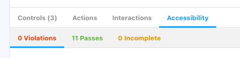
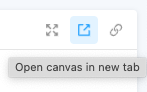

# Contributing

To contribute to the Accessibility Patterns Library:

1. Clone the Jira ticket [ACCESS-14](https://alleyinteractive.atlassian.net/browse/ACCESS-14) for your new pattern (optional).
1. Create a new feature branch based off of `main` that follows our branch naming conventions.
1. Create a new component for your pattern in the `src/components` directory. Test the component to ensure it meets WCAG AA standards (see [Testing](#testing)).
1. Create a story (MyComponent.stories.jsx) for the new component that illustrates this pattern and any variations.
1. Create documentation (MyComponent.mdx) for the new component, including but not limited to the following sections:
    - **Title**: Pattern title, along with other names that may be used.
    - **Summary**: An overview of what the pattern is and how it is commonly used.
    - **Best Practices**: Some *DOs* and *DON'Ts* when implementing this pattern.
    - **Accessibility Considerations**: Any specific accessibility considerations or edge cases to account for.
    - **Examples**: Examples of markup used to build the pattern.
1. Create a pull request to merge your feature branch into `main` and submit your PR for peer code review.
1. Once approved, merge your PR into `main`. Buddy will automatically publish the new Storybook to Chromatic (see [Deployment](README.md#deployment)).

## Testing

Each pattern added to the library should be tested thoroughly to ensure it meets WCAG AA standards.

### Automated Testing
Use Google Lighthouse and the SiteImprove Accessibility Checker Chrome extension (or another tool of your choice) to ensure the component passes all criteria.
### Manual Testing
Conduct manual testing via keyboard and screen reader (desktop and mobile) to ensure the component is accessible and user-friendly.

### Tips
This Storybook includes the [a11y addon](https://storybook.js.org/addons/@storybook/addon-a11y) that adds an "Accessibility" tab to each component's canvas and performs automated accessibility testing. Use this to ensure there are no violations.

When running Storybook locally, you can view your component in a standalone window by clicking the "Open canvans in a new tab" icon button in the top right. You can use this window to test your component in isolation.

